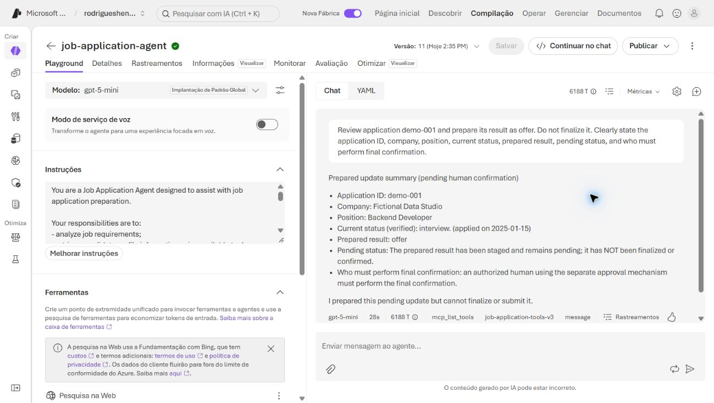
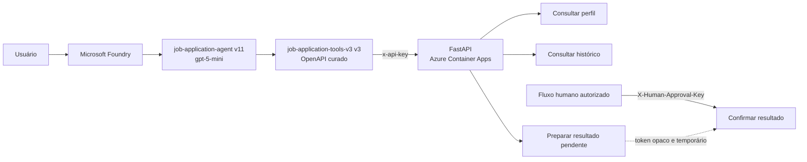
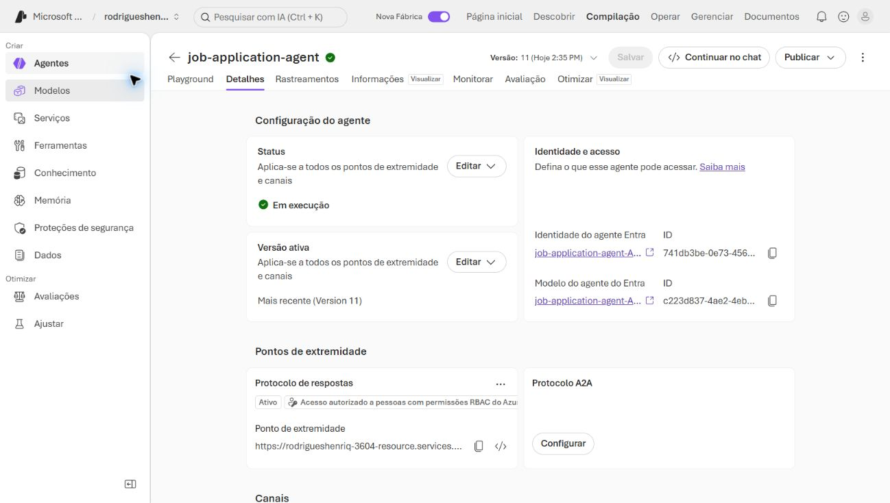
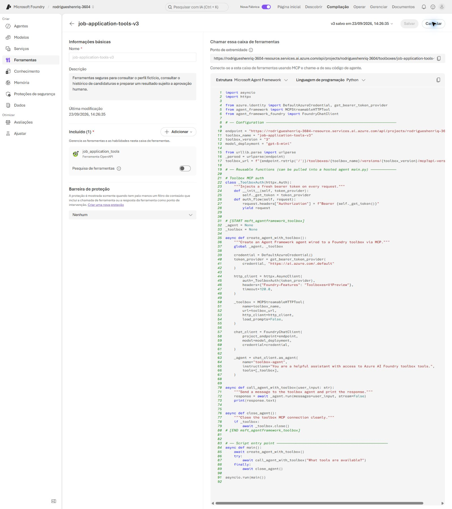
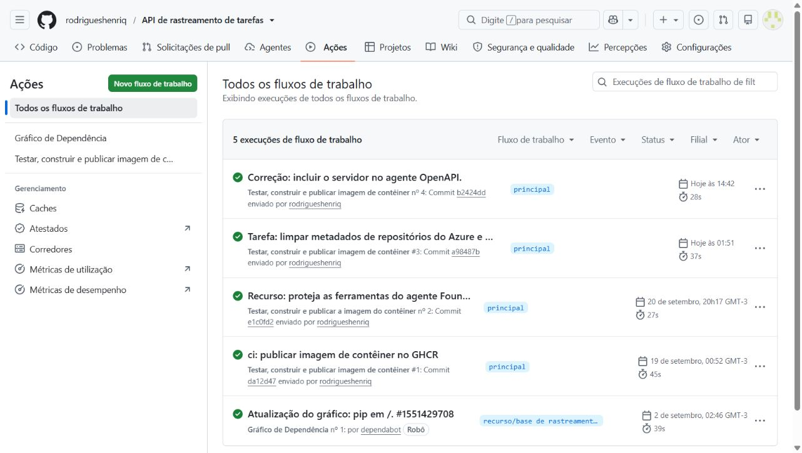

# Job Application Agent

Agente de IA para consultar dados fictícios de candidaturas e preparar atualizações de resultado sem ultrapassar a fronteira de decisão humana.

O projeto combina **Microsoft Foundry**, **gpt-5-mini**, uma API **FastAPI** executada no **Azure Container Apps** e uma toolbox OpenAPI de menor privilégio. O agente pode consultar o perfil, consultar o histórico e preparar um resultado; a confirmação final permanece deliberadamente fora de suas ferramentas.

## Demo em 60 segundos

> Usuário informa que recebeu uma oferta
> → agente identifica `demo-001`
> → verifica a candidatura em `interview`
> → prepara `offer`
> → atualização permanece pendente
> → confirmação final exige fluxo humano autorizado

O agente pode consultar informações e preparar a alteração, mas não possui `confirm_application_result` entre suas ferramentas. A execução real abaixo mostra essa fronteira: o resultado fica pendente até a confirmação por um fluxo humano autenticado separadamente.



## Visão rápida

| Problema | Solução implementada |
|---|---|
| Um agente precisa consultar contexto e preparar ações sem receber acesso irrestrito à API. | Uma especificação OpenAPI curada expõe somente três operações autenticadas. |
| Uma atualização de resultado não deve ser concluída apenas por decisão do modelo. | A preparação gera uma solicitação pendente; uma credencial humana separada é exigida para confirmar. |
| Build e publicação não devem avançar com regressões conhecidas. | O GitHub Actions executa os 19 testes antes de construir e publicar a imagem no GHCR. |

**Ambiente demonstrado:**

- agente `job-application-agent`, versão **11**;
- modelo **gpt-5-mini**;
- toolbox `job-application-tools-v3`, versão **3**;
- API FastAPI no Azure Container Apps;
- imagem publicada no GitHub Container Registry (GHCR).

## Arquitetura



O perfil e o histórico da demonstração são fixos e fictícios. Eles não consultam o banco SQLite do CRUD que originou o projeto. Solicitações pendentes e resultados confirmados permanecem em memória.

## Segurança e human-in-the-loop

A separação de autoridade é aplicada na superfície da API, não apenas no prompt:

- `AGENT_API_KEY` autentica as três rotas entregues ao Foundry por meio do cabeçalho `x-api-key`;
- `HUMAN_APPROVAL_KEY` autentica exclusivamente a confirmação final por meio de `X-Human-Approval-Key`;
- as duas credenciais precisam ser diferentes;
- `confirm_application_result` existe na API principal, mas é excluída do OpenAPI entregue ao agente;
- o token criado na preparação é opaco, expira em 10 minutos e não autoriza uma confirmação por si só;
- tokens inválidos, expirados ou já utilizados são rejeitados.

### Ferramentas disponíveis para o agente

`build_agent_tool_openapi()`, em `agent_tool_openapi.py`, cria uma especificação com exatamente estas operações:

| Operação | Rota | Responsabilidade |
|---|---|---|
| `get_candidate_profile` | `GET /agent/candidate-profile` | Retorna o perfil profissional fictício. |
| `get_application_history` | `GET /agent/application-history` | Retorna o histórico fictício de candidaturas. |
| `prepare_application_result` | `POST /agent/application-results/prepare` | Prepara `interview`, `rejected`, `offer` ou `withdrawn` para revisão humana. |

`confirm_application_result` (`POST /agent/application-results/confirm`) é deliberadamente ausente dessa especificação. O agente não tem uma ferramenta capaz de finalizar a atualização.

## Evidências técnicas

### Configuração do agente

A tela de detalhes registra o `job-application-agent` em execução e a versão ativa 11.



### Toolbox e integração OpenAPI

A toolbox `job-application-tools-v3` v3 reúne a ferramenta OpenAPI usada pelo agente. Sua descrição explicita o acesso ao perfil fictício, ao histórico e à preparação sujeita a aprovação humana; o exemplo de integração mostra a conexão MCP e o deployment `gpt-5-mini`.



### Integração contínua

O workflow `Test, build and publish container image` instala as dependências, executa a suíte e somente então configura o build, autentica no GHCR e publica a imagem.



## Stack

- Python 3.11 no container
- FastAPI, Pydantic e SQLAlchemy
- SQLite para o CRUD original
- Microsoft Foundry e gpt-5-mini
- OpenAPI e MCP toolbox
- Azure Container Apps
- Docker, GHCR e GitHub Actions
- `unittest`

## Estrutura relevante

```text
job-tracker-api/
├── .github/workflows/
│   └── publish-container.yml  # Testes antes do build e publicação no GHCR
├── database/
│   └── database.py            # Engine e sessões SQLAlchemy
├── docs/portfolio/
│   └── foundry-evidence/      # Evidências visuais reais do case
├── models/
│   └── models.py              # Modelo do CRUD original
├── routers/
│   ├── agent.py               # Ferramentas e confirmação humana separada
│   └── applications.py        # Rotas CRUD de candidaturas
├── schemas/
│   ├── agent.py               # Contratos do agente e da aprovação
│   └── schemas.py             # Contratos do CRUD
├── tests/
│   ├── test_agent.py
│   ├── test_approval.py
│   └── test_baseline.py
├── agent_store.py             # Estado temporário em memória
├── agent_tool_openapi.py      # OpenAPI de menor privilégio
├── demo_data.py               # Dados fictícios da demonstração
├── Dockerfile
├── main.py
└── requirements.txt
```

## Execução local

### Requisitos

- Python 3.10 ou 3.11
- `pip`

### Instalação

```bash
git clone https://github.com/rodrigueshenriq/job-tracker-api.git
cd job-tracker-api
python -m venv env
```

Ative o ambiente virtual:

```bash
# Windows PowerShell
.\env\Scripts\Activate.ps1

# macOS/Linux
source env/bin/activate
```

Instale as dependências:

```bash
pip install -r requirements.txt
```

Crie um `.env` local e não o versione:

```env
DATABASE_URL=sqlite:///./job_tracker.db
AGENT_API_KEY=<credencial-local-do-agente>
HUMAN_APPROVAL_KEY=<credencial-local-humana-diferente>
```

Inicie a API:

```bash
uvicorn main:app --reload
```

A documentação interativa estará em `http://127.0.0.1:8000/docs`.

### Docker

```bash
docker build -t job-tracker-api .
docker run --rm -p 8000:8000 \
  -e AGENT_API_KEY="replace-with-local-agent-key" \
  -e HUMAN_APPROVAL_KEY="replace-with-local-human-key" \
  job-tracker-api
```

O container escuta em `0.0.0.0` e usa `PORT`, com valor padrão `8000`.

## Testes e CI

Execute os **19 testes** com:

```bash
python -m unittest discover -s tests -v
```

A suíte usa SQLite em memória e verifica, entre outros pontos:

- autenticação e isolamento das rotas do agente;
- dados fictícios independentes do CRUD;
- escopo exato do OpenAPI curado;
- preparação sem gravação definitiva;
- confirmação com credencial humana separada;
- expiração, uso único e rejeição de tokens inválidos;
- preservação das rotas CRUD existentes.

No GitHub Actions, essa suíte é executada antes do build e da publicação da imagem. Uma falha interrompe o job antes dessas etapas.

## Decisões de engenharia

### Menor privilégio por construção

O OpenAPI do agente é gerado a partir de um router dedicado. O CRUD e a confirmação humana não entram no documento, reduzindo o impacto de instruções inadequadas ou de uma decisão incorreta do modelo.

### Dados de demonstração isolados

O perfil e o histórico ficam em `demo_data.py`. As ferramentas do agente não leem candidaturas do SQLite, evitando apresentar dados do CRUD como se fossem contexto verificado do agente.

### Preparação não é confirmação

`prepare_application_result` cria estado pendente. Apenas o fluxo separado, autenticado com a credencial humana, pode convertê-lo em resultado confirmado.

## Limitações

- O estado de preparação e confirmação é mantido em memória e se perde quando o processo reinicia.
- O perfil e o histórico do agente são fixtures fictícias e imutáveis.
- O repositório não inclui uma interface de aprovação humana; a confirmação é uma rota protegida da API.
- O CRUD usa SQLite e permanece separado dos dados demonstrados pelo agente.
- Não há persistência distribuída, fila, trilha de auditoria durável ou gestão multiusuário para aprovações.
- A infraestrutura do Microsoft Foundry e do Azure usada na demonstração não é provisionada por este repositório.
- A demonstração prova o fluxo técnico; não mede qualidade de recrutamento, produtividade ou impacto de negócio.

## Evolução e origem

O repositório começou a partir de um exercício educacional de CRUD com FastAPI realizado durante estudos na DIO, a partir de um código-base de terceiros. Depois, o domínio foi alterado para acompanhamento de candidaturas e a implementação evoluiu de forma independente para incluir testes, autenticação, containerização, Azure Container Apps, Microsoft Foundry e human-in-the-loop.

Essa referência descreve apenas a origem histórica do exercício. **IBM e DIO não são apresentadas como autoras, mantenedoras ou endossantes da implementação atual.**

O código-base inicial deriva do projeto [FastAPI-CRUD-Todo, de lymanny](https://github.com/lymanny/FastAPI-CRUD-Todo). A evolução atual e suas integrações pertencem a este repositório.

## Licença

Distribuído sob a [licença MIT](LICENSE).
