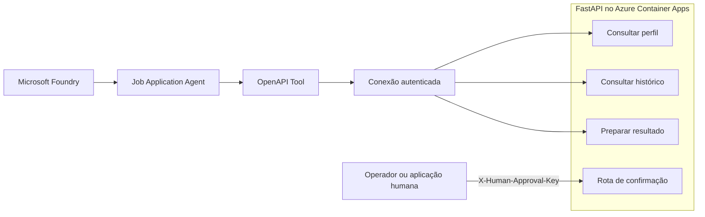

# Job Application Agent

Projeto de engenharia de software e IA que integra uma API Python/FastAPI ao Microsoft Foundry para consultar informações fictícias de candidaturas e preparar um resultado de candidatura para revisão humana.

O projeto nasceu como um CRUD de acompanhamento de candidaturas e evoluiu para demonstrar um agente com ferramentas OpenAPI autenticadas, escopo mínimo de acesso e uma fronteira explícita entre automação e decisão humana.

## O que foi construído

- Um agente no Microsoft Foundry integrado a uma API FastAPI por OpenAPI.
- Três operações autenticadas para consultar perfil, consultar histórico e preparar um resultado.
- Uma confirmação separada, indisponível ao agente e protegida por credencial humana própria.
- Uma API conteinerizada, publicada no GHCR pelo GitHub Actions e executada no Azure Container Apps.

## Visão geral

O `job-application-agent` usa uma especificação OpenAPI curada para acessar apenas três operações da API. A ferramenta não recebe acesso ao CRUD completo nem à operação de confirmação.

No ambiente de demonstração atual:

- o agente `job-application-agent` está configurado no Microsoft Foundry;
- a ferramenta ativa é `job-application-tools-v3`;
- a API FastAPI é executada no Container App `job-agent-api`, no Azure Container Apps;
- a imagem de container é construída e publicada no GitHub Container Registry (GHCR) pelo GitHub Actions;
- a conexão do projeto Foundry autentica as chamadas com o cabeçalho HTTP `x-api-key`.

O perfil e o histórico usados pelo agente são fixos e fictícios. Eles não leem o banco SQLite utilizado pelo CRUD original. A preparação e a confirmação mantêm estado temporário em memória.

## Arquitetura



O fluxo do agente e o fluxo de confirmação usam credenciais diferentes:

- `AGENT_API_KEY`: autoriza somente as rotas incluídas no OpenAPI curado e é enviada como `x-api-key` pela conexão do Foundry;
- `HUMAN_APPROVAL_KEY`: autoriza a confirmação final e deve permanecer apenas na aplicação ou no ambiente controlado pelo operador humano.

## Ferramentas disponíveis para o agente

A função `build_agent_tool_openapi()`, em `agent_tool_openapi.py`, gera o documento entregue ao Microsoft Foundry. Ele contém exatamente estas operações:

| Operação | Método e rota | Responsabilidade |
|---|---|---|
| `get_candidate_profile` | `GET /agent/candidate-profile` | Retorna um perfil profissional fictício para a demonstração. |
| `get_application_history` | `GET /agent/application-history` | Retorna um histórico fictício de candidaturas. |
| `prepare_application_result` | `POST /agent/application-results/prepare` | Prepara um resultado para revisão, sem confirmá-lo. |

Todas exigem uma `AGENT_API_KEY` válida por meio do cabeçalho HTTP `x-api-key`. Se a credencial não estiver configurada, a API mantém as ferramentas indisponíveis; credenciais ausentes ou inválidas são recusadas.

### Operação deliberadamente excluída

`confirm_application_result` (`POST /agent/application-results/confirm`) **não é disponibilizada ao agente**.

O agente pode preparar uma ação, mas não pode executar sozinho a confirmação final. A preparação cria uma solicitação pendente com um token opaco e validade de 10 minutos. Depois da revisão, uma aplicação ou um operador confiável precisa chamar a rota de confirmação com:

- o token da solicitação preparada; e
- a credencial independente `HUMAN_APPROVAL_KEY`, enviada no cabeçalho HTTP `X-Human-Approval-Key`.

Tokens inválidos, expirados ou já utilizados são rejeitados. O token de preparação, isoladamente, não autoriza a confirmação.

## Tecnologias

- Python 3.11 no container
- FastAPI
- Pydantic
- SQLAlchemy e SQLite
- Microsoft Foundry
- OpenAPI
- Azure Container Apps
- Docker
- GitHub Actions e GitHub Container Registry
- `unittest`

## Estrutura relevante

```text
job-tracker-api/
├── .github/workflows/
│   └── publish-container.yml  # Build e publicação da imagem no GHCR
├── database/
│   └── database.py            # Engine e sessões SQLAlchemy
├── models/
│   └── models.py              # Modelo do CRUD original
├── routers/
│   ├── agent.py               # Ferramentas e confirmação humana separada
│   └── applications.py        # Rotas CRUD de candidaturas
├── schemas/
│   ├── agent.py               # Contratos do agente e da aprovação
│   └── schemas.py             # Contratos do CRUD
├── tests/
│   ├── test_agent.py          # Autenticação, dados e operações do agente
│   ├── test_approval.py       # Preparação e aprovação humana
│   └── test_baseline.py       # Baseline da aplicação e das rotas
├── agent_store.py             # Estado temporário das solicitações preparadas
├── agent_tool_openapi.py      # Geração do OpenAPI de menor privilégio
├── demo_data.py               # Dados fictícios da demonstração
├── Dockerfile
├── main.py                    # Entrypoint FastAPI
└── requirements.txt
```

## Execução local

### Requisitos

- Python 3.10 ou 3.11
- `pip`

### Instalação

```bash
git clone https://github.com/rodrigueshenriq/job-tracker-api.git
cd job-tracker-api
python -m venv env
```

Ative o ambiente virtual:

```bash
# Windows PowerShell
.\env\Scripts\Activate.ps1

# macOS/Linux
source env/bin/activate
```

Instale as dependências:

```bash
pip install -r requirements.txt
```

Crie um arquivo `.env` local, sem versioná-lo:

```env
DATABASE_URL=sqlite:///./job_tracker.db
AGENT_API_KEY=<defina-uma-credencial-local>
HUMAN_APPROVAL_KEY=<defina-outra-credencial-local>
```

As duas credenciais devem ter valores diferentes. Não use os placeholders acima em um ambiente compartilhado ou publicado.

Inicie a API:

```bash
uvicorn main:app --reload
```

A documentação interativa fica disponível em `http://127.0.0.1:8000/docs`.

### Docker

```bash
docker build -t job-tracker-api .
docker run --rm -p 8000:8000 \
  -e AGENT_API_KEY="replace-with-local-agent-key" \
  -e HUMAN_APPROVAL_KEY="replace-with-local-human-key" \
  job-tracker-api
```

O exemplo acima usa valores locais ilustrativos, que devem ser substituídos. O container executa a aplicação em `0.0.0.0` e usa a variável `PORT`, com valor padrão `8000`.

## Testes automatizados

Execute a suíte com:

```bash
python -m unittest discover -s tests -v
```

Os testes usam SQLite em memória e não acessam `job_tracker.db`. A suíte cobre, entre outros comportamentos:

- exigência e validação da credencial do agente;
- isolamento entre os dados fictícios e o banco do CRUD;
- conteúdo e escopo do OpenAPI curado;
- preparação sem gravação do resultado;
- confirmação com credencial humana separada;
- expiração, uso único e rejeição de tokens inválidos;
- preservação das rotas CRUD que originaram o projeto.

## Demonstração

No ambiente de demonstração documentado, `get_candidate_profile` já foi executada com sucesso pelo caminho agente no Foundry → ferramenta OpenAPI → conexão autenticada → API FastAPI. Essa validação confirma especificamente a operação de consulta do perfil.

As demais etapas abaixo formam o roteiro proposto para uma demonstração completa do fluxo:

1. pedir ao agente o perfil do candidato;
2. consultar o histórico fictício de candidaturas;
3. solicitar a preparação de um resultado permitido;
4. mostrar que o agente não possui a operação de confirmação;
5. revisar e confirmar a solicitação por um fluxo humano separado.

O roteiro permite demonstrar as três operações do agente e a fronteira de confirmação humana sem atribuir ao agente autoridade para concluir a ação sensível.

## Decisões de engenharia

### OpenAPI curado

A aplicação possui outras rotas, mas o agente recebe uma especificação construída apenas com `tool_router`. Isso evita depender somente de instruções de prompt para controlar acesso.

### Dados fictícios e isolados

O perfil e o histórico da demonstração ficam em `demo_data.py`. As ferramentas não consultam as candidaturas armazenadas pelo CRUD, reduzindo o risco de exposição acidental de dados reais.

### Escopo controlado

O objetivo é demonstrar integração de agente, autenticação e aprovação humana. O projeto preserva o CRUD como parte de sua evolução, mas não amplia o escopo com funcionalidades que não contribuam para essa demonstração.

## Limitações conscientes

- Solicitações pendentes e resultados confirmados são mantidos em memória e se perdem quando o processo reinicia.
- O perfil e o histórico acessados pelo agente são fixos e fictícios.
- A confirmação humana é uma rota de API protegida por credencial; este repositório não inclui uma interface de aprovação.
- O CRUD usa SQLite e permanece separado dos dados da demonstração do agente.
- A configuração dos recursos do Microsoft Foundry e do Azure pertence ao ambiente de demonstração e não é reproduzida integralmente neste repositório.

Essas limitações são compatíveis com o objetivo atual de portfólio e devem ser consideradas antes de qualquer uso além da demonstração.

## Evolução do projeto

O histórico do repositório registra a transformação incremental do projeto:

1. API CRUD baseada no projeto FastAPI Todo original;
2. adaptação para o domínio de candidaturas;
3. criação de testes de baseline;
4. inclusão de ferramentas de consulta para o agente;
5. implementação do fluxo de preparação e aprovação humana;
6. containerização, publicação no GHCR e integração com Microsoft Foundry e Azure Container Apps;
7. proteção das ferramentas por chave de API.

## Licença e origem

Distribuído sob a licença MIT. Consulte [LICENSE](LICENSE).

O projeto evoluiu a partir do [FastAPI-CRUD-Todo](https://github.com/lymanny/FastAPI-CRUD-Todo), de [lymanny](https://lymanny.onrender.com), usado como ponto de partida para o domínio de candidaturas.
